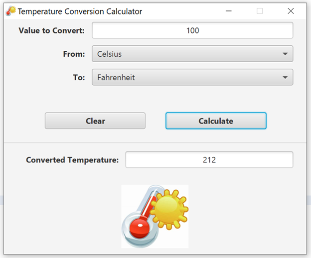

# TemperatureConversionCalculator
Convert temperatures between Fahrenheit, Celsius, Kelvin, and Rankine.
This is homework assignment from National University (Advanced programming in Java).
This is a JavaFX application to convert a given temperature between Fahrenheit, Celsius, Kelvin, and Rankine.

